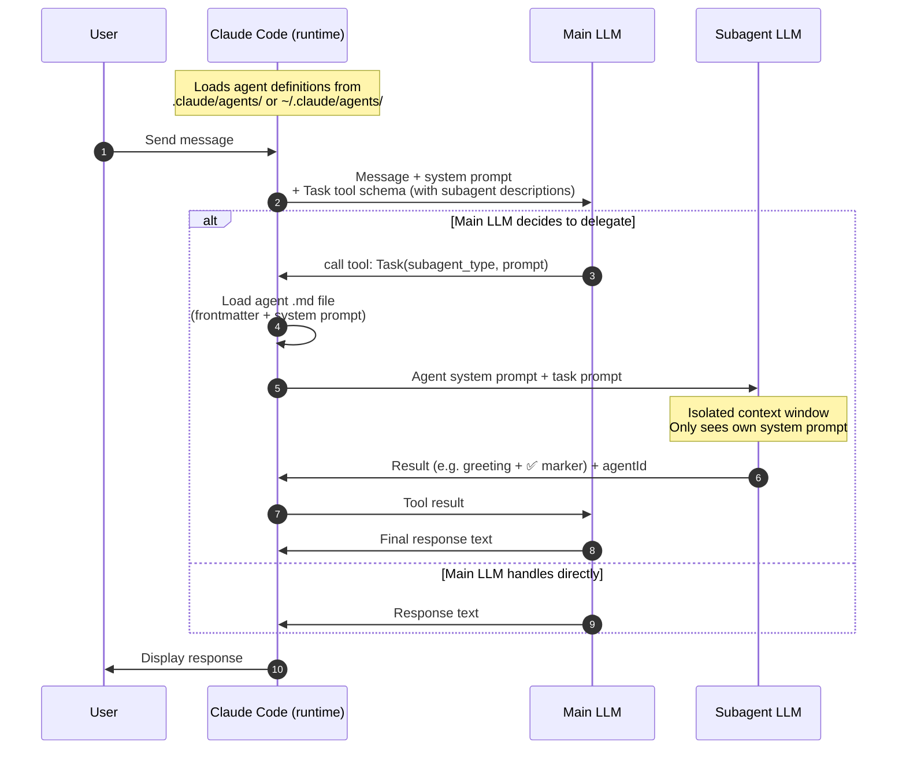

# Claude Code Subagent Execution Flow

This README documents the interaction flow between the User, Claude Code (runtime), the Main LLM, and the Subagent LLM when subagents are used.

## Sequence Diagram

## Step Details

1. **Agent Discovery**: At session start, Claude Code loads all `*.md` files from `.claude/agents/`, `~/.claude/agents/`, and any `--agents` CLI definitions. Each agent's `name` and `description` are injected into the Task tool schema sent to the Main LLM.

2. **LLM Decision**: The Main LLM evaluates the user request against each subagent's `description`. If matched, it calls the Task tool. The match can be triggered:
   - **Proactively**: User says "hi" → LLM matches `greeting-responder` description
   - **Explicitly**: User says "use subagent X" → direct call

3. **Subagent Spawn**: Claude Code intercepts the Task tool call, reads the agent's `.md` file, and starts a new LLM session with:
   - The agent's system prompt (from the `.md` body)
   - The task prompt (from `Task.prompt`)
   - Only the tools listed in the agent's frontmatter

4. **Isolated Execution**: The Subagent LLM runs entirely in its own context window. It has no access to the main conversation history.

5. **Result Return**: The subagent returns its output + an `agentId`. Claude Code passes the result back to the Main LLM as a tool result.

6. **Final Response**: The Main LLM receives the tool result and generates the final response shown to the user. It may summarize, relay verbatim, or omit internal markers.

## Key Distinction vs. Skills

| | Skill | Subagent |
|---|---|---|
| Execution context | Main LLM context | Isolated LLM context |
| Decision maker | Main LLM calls `Skill` tool | Main LLM calls `Task` tool |
| Context access | Full conversation history | Own system prompt only |
| Resumable | No | Yes (via `agentId`) |

## Related

- [practice.md](practice.md) — Step-by-step tutorial with verifiable examples
- [../skills/README.md](../skills/README.md) — Skills execution flow for comparison
- Official docs: [Create custom subagents](https://code.claude.com/docs/en/sub-agents)
