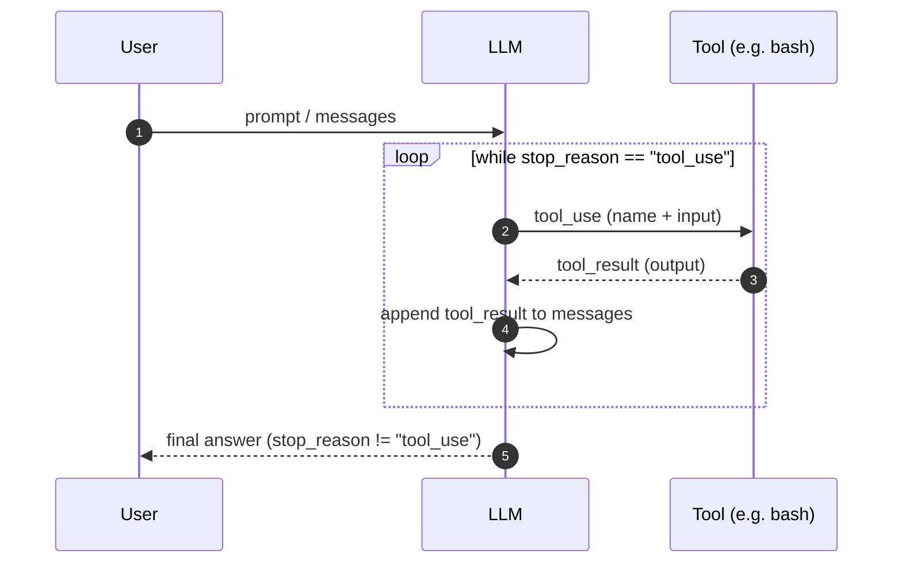

## The Agent Loop (the whole secret)

The entire secret of an AI coding agent in one pattern:

```python
while stop_reason == "tool_use":
    response = LLM(messages, tools)
    execute tools
    append results
```

### Diagram



```text
+----------+      +-------+      +---------+
|   User   | ---> |  LLM  | ---> |  Tool   |
|  prompt  |      |       |      | execute |
+----------+      +---+---+      +----+----+
                      ^               |
                      |   tool_result |
                      +---------------+
                      (loop continues)
```

This is the core loop: feed tool results back to the model until the model decides to stop.
Production agents layer policy, hooks, and lifecycle controls on top.
