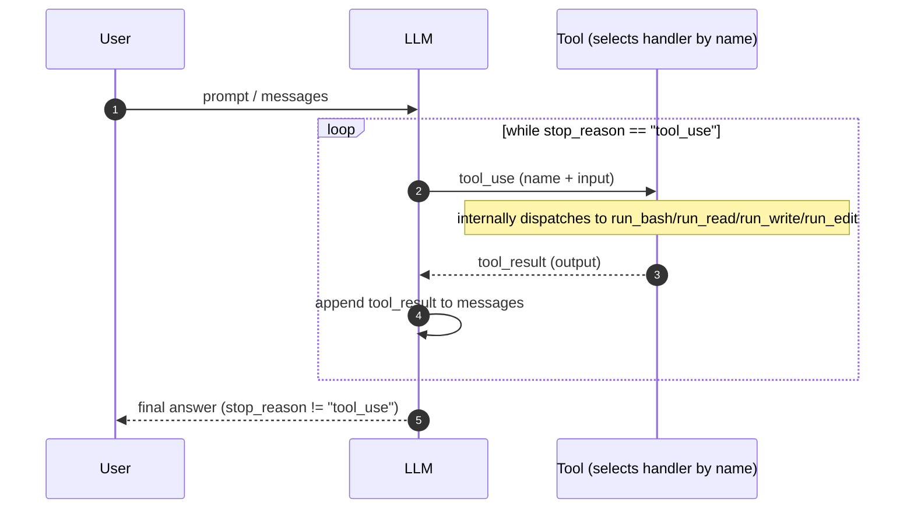

## Tool Use (dispatch layer)

The agent loop from `s01` didn't change. We just added more tools to the `tools` array and a dispatch map to route calls.

### Diagram



```text
+----------+      +-------+      +-------------------+
|   User   | ---> |  LLM  | ---> | Tool Dispatch     |
|  prompt  |      |       |      | {                 |
+----------+      +---+---+      |   bash: run_bash  |
                      ^          |   read: run_read  |
                      |          |   write: run_write|
                      +----------+   edit: run_edit  |
                      tool_result| }                 |
                                 +-------------------+
```

### Example walkthrough (dispatch)

- **LLM requests a tool** (e.g. `bash`) via a `tool_use` block.
- **Tool picks a handler** by `name` (e.g. `"bash" -> run_bash`) and runs it.
- **Return `tool_result`** to the LLM and continue the same loop.

**Key insight**: The loop didn't change at all. We just added tools.
