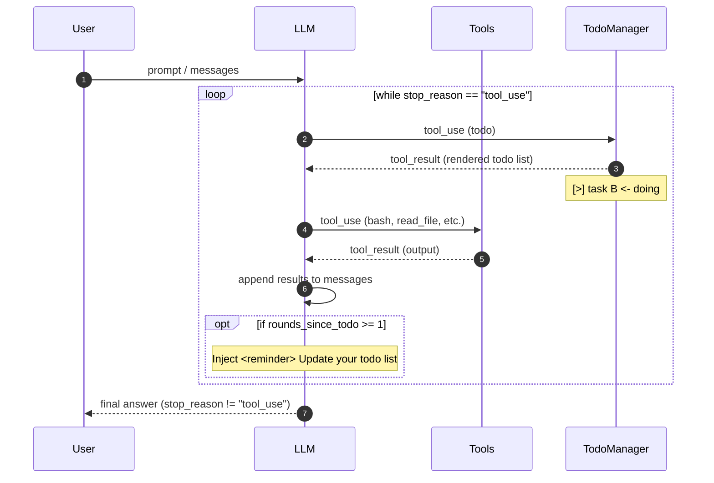

## Todo and Memory (todo tool)

The model tracks its own progress via a `TodoManager`. A nag reminder forces it to keep updating when it forgets.

### Diagram



```text
    +----------+      +-------+      +---------+
    |   User   | ---> |  LLM  | ---> | Tools   |
    |  prompt  |      |       |      | + todo  |
    +----------+      +---+---+      +----+----+
                          ^               |
                          |   tool_result |
                          +---------------+
                                |
                    +-----------+-----------+
                    | TodoManager state     |
                    | [ ] task A            |
                    | [>] task B <- doing   |
                    | [x] task C            |
                    +-----------------------+
                                |
                    if rounds_since_todo >= 1:
                      inject <reminder>
```

**Key insight**: "The agent can track its own progress -- and I can see it."
