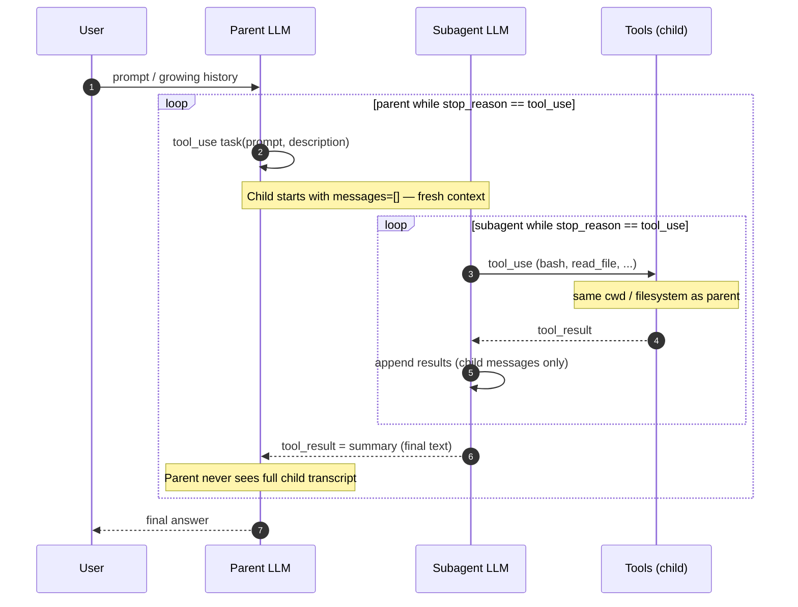

## Subagent (fresh context via `task`)

Spawn a child agent with fresh `messages=[]`. The child works in its own context, sharing the filesystem, then returns only a summary to the parent.

### Diagram



```text
    Parent agent                     Subagent
    +------------------+             +------------------+
    | messages=[...]   |             | messages=[]      |  <-- fresh
    |                  |  dispatch   |                  |
    | tool: task       | ----------->| while tool_use:  |
    |   prompt="..."   |             |   call tools     |
    |   description="" |             |   append results |
    |                  |  summary    |                  |
    |   result = "..." | <-----------| return last text |
    +------------------+             +------------------+
              |
    Parent context stays clean.
    Subagent context is discarded.

```

**Key insight**: "Process isolation gives context isolation for free."
