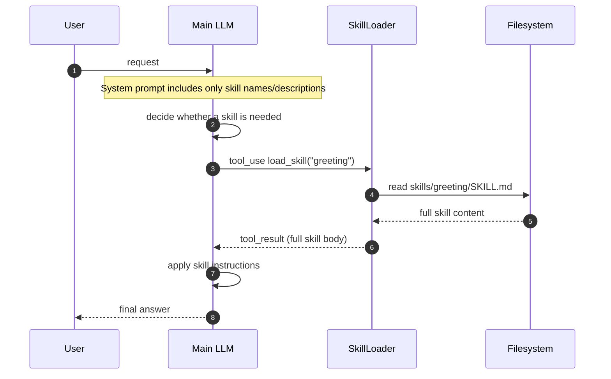

## Skill Loading (two-layer injection)

Avoid bloating the system prompt by splitting skill injection into two layers:

- Layer 1 (cheap): inject only skill metadata (`name` + `description`) into the system prompt.
- Layer 2 (on demand): return full `SKILL.md` body only when the model calls `load_skill(name)`.

### Diagram



```text
skills/
  doc-summary/
    SKILL.md          <-- frontmatter (name, description) + body
  greeting/
    SKILL.md

System prompt:
+--------------------------------------+
| You are a coding agent.              |
| Skills available:                    |
|   - greeting: Responds to user ...   |  <-- Layer 1: metadata only
|   - doc-summary: Summarizes ...      |
+--------------------------------------+

When model calls load_skill("greeting"):
+--------------------------------------+
| tool_result:                         |
| <skill>                              |
|   Greeting processing instructions   |  <-- Layer 2: full body
|   Step 1: ...                        |
|   Step 2: ...                        |
| </skill>                             |
+--------------------------------------+
```

**Key insight**: "Don't put everything in the system prompt. Load on demand."
