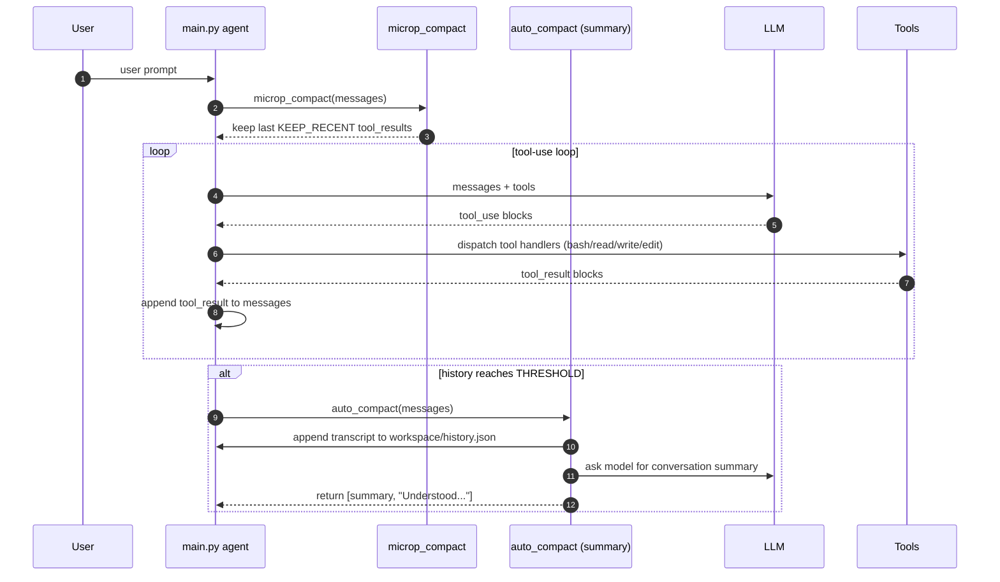

## Context Compact (tool-result + summary)

This course demonstrates two complementary strategies to keep an agent’s prompt small:

1. `microp_compact`: lightweight compression inside the current chat history (only tool outputs).
2. `auto_compact`: heavier compression when history grows too large (save history + ask the model for a summary).

## What the code does

### Diagram


### 1) `microp_compact(messages)`

When there are many `tool_result` blocks, this function:
- keeps the most recent `KEEP_RECENT` tool results
- replaces older tool results with a short marker:
  `COMPRESSED_TOOL_RESULT: replaced original output, tool=<tool_name>`

This reduces token usage while still keeping enough signal about recent tool usage.

### 2) `auto_compact(messages)`

When the total message count reaches `THRESHOLD`:
- it appends the current `messages` to `workspace/history.json` (one JSON object per line)
- it asks the model to produce a short conversation summary
- it returns a new minimal message list containing the summary and an "Understood" acknowledgement

The next loop continues from the summary instead of the full transcript.

```text
messages grow
   |
   |--[microp_compact]--> shrink older tool outputs (keep last KEEP_RECENT)
   |
   `--[auto_compact @ THRESHOLD]--> save transcript -> ask LLM for summary -> continue from summary
```

## Tools

The agent exposes these tools to the model:
- `bash`: run a shell command (educational safety checks only)
- `read_file`: read a file (optionally limited by line count)
- `write_file`: write content to a file
- `edit_file`: replace an exact substring in a file

## Run

From this repo root:

```bash
cd courses/s06_context_compact
python main.py
```

Make sure `ANTHROPIC_API_KEY` (or compatible auth env vars) is set. You can also override the model via `ANTHROPIC_MODEL`.

## Key insight

Don’t just “summarize eventually”. Combine:
- micro compression for frequently repeated tool outputs
- macro summarization for full-history growth

