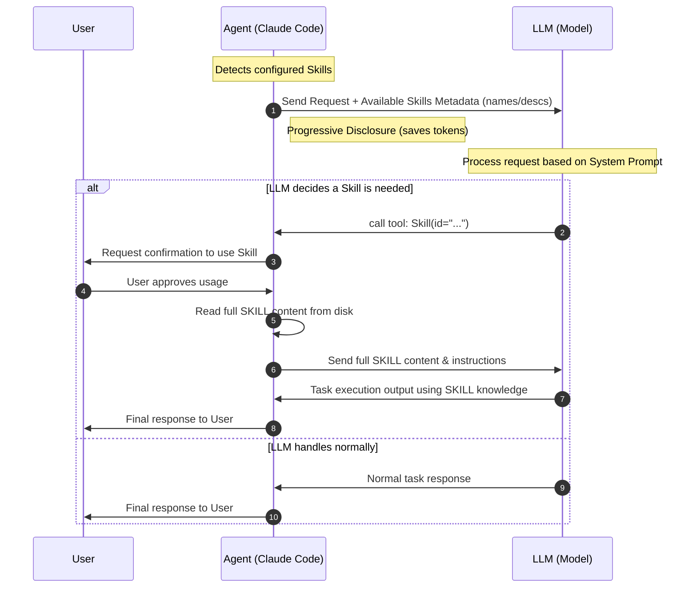

# Claude Code & Model SKILLs Interaction Flow

This README documents the interaction flow between the User, Claude Code (Agent), and the LLM (Model) when using SKILLs.

## Sequence Diagram

## Step Details

1.  **Metadata Disclosure**: Claude Code identifies local skills. It only sends metadata (names and descriptions) within the `Skill` tool definition to the LLM. This **Progressive Disclosure** ensures tokens are saved unless a skill is actually needed.
2.  **Model Decision**: The LLM evaluates if any available skill matches the criteria defined in its system prompt.
3.  **User Confirmation**: If a match is found, the LLM calls the `Skill` tool. Claude Code intercepts this and asks the User for permission.
4.  **Full Content Loading**: Once approved, Claude Code reads the specific `.md` file content for that skill and provides it to the LLM.
5.  **Execution**: The LLM uses the detailed skill knowledge to fulfill the request.